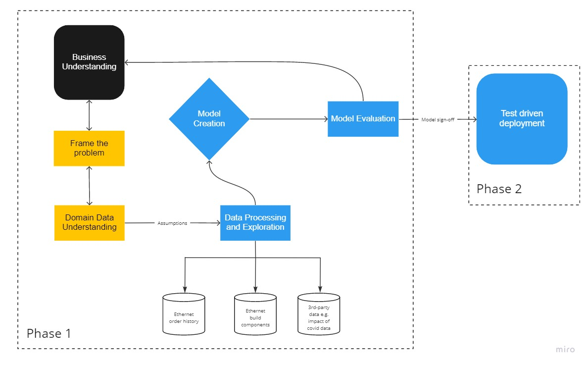

[TOC]

# Decision Science Case Study

[[_TOC_]]

## Current Scenario

- Manual predictions using Excel

- Process is different across 4 different regions of Openreach

- Delivery date is only set after planning stage is completed

- The core objective is to provide a more efficient way of **predicting** and **estimating** a more accurate delivery date for Openreach's customers.

- **Predicting** refers to minimising human effort and **estimating** refers to precision with approximating delivery dates.

  ​

## What is the Proposed Solution?

**Working project name: Project X**

Automating this predictions using machine learning.

1. Multivariate timeseries regression model – We want to capture trends/patterns in the data which occur over different time periods. Algorithms include: ARMA, Multi-Prophet

2. Cross validated regression model

   ​

## Measuring the effectiveness of the solution

- Using evaluation metric;
  - Root Mean Squared Errors which give relatively high weights to large errors. Optimising the RMSE means we are aiming to minimise the difference between the predicted dates and actual delivery dates such that the closer we are to the actual delivery date, the better. This way, we can tell a model that predicts delivery dates that are much closer to the actual delivery date. This is the preferred of the 2 measures.
  - Mean Absolute Error: Every error has the same weight. Using this metric, there will be instances where the predicted delivery date is far off the actual delivery date and because MAE weights errors equally this will mean a model with delivery dates that are farther away from the actual delivery dates.
- Out of sample Cross Validation; train with 2017-2020 data, test with 2021 data

## Project X Solution Architecture

To capture the value for this proposal there are other factors that compliment the delivery of this project. These factors are **Infrastructure, People, Tools, Organisation and Processes**. These will help get a better feel for the business case and how to use the resources, assets available to deliver value.

- **Infrastructure** - Cloud services, open-source technologies we can leverage to build on top of. 

- **People** - Map out the roles and skills of the team and identify strengths and skill gaps.

- **Tools** - Building tools to **encapsulate** and **frameworks** to automate. 

- **Organisation** - Encouraging agile methodology. Building flexibility.

- **Processes** - Standardised project structures, version control and codebase practices.

The delivery of this project has been split into 2 phases. 

**Phase 1**

- Delivery of MVP, a prototype solution.
- This involves framing the problem, identifying the stakeholders and designing a baseline model that can deliver the minimum viable product. 

**Phase 2**

- Delivery of product. 
  **Note: This is not captured in detail in the solution architecture below.**
- ****This involves designing an improved model which will the product will be built on.

> Assumptions for cases with very little data to train with.
>
> These assumptions will go through hypothesis tests to ascertain if the assumptions are valid.

### Value Framework

The value framework/key performance indicators are key towards monitoring the progress of the product development. Transparency and Integrity are core to the foundation of the core product value framework. Efficiency and Accuracy ***are add-ons which ensure that the tool which sits upon this robust platform is capable of delivering accurate and efficient value.*** 

- Transparency

  - Transparency and accountability are products of good data governance. Does the product allow domain agnostic operability?

- Integrity

  - Robust enough to meet the requirements of all the teams relying on this product?
  - Can this tool be relied upon short term and long term?
  - How will this product be maintained?

- Efficient

  - Does it deliver value?

- Accuracy

  - Are the predicted dates reliable and not too far from the expected?
  - Does it minimize errors compared to manual predictions?

  ​

The core value from this project is improving certainty for our customers.

How would we achieve this? By creating a more efficient way of estimating delivery completion date.

### Delivery

#### How will you use your team?

Assuming resource is not constrained, this will be a 12 weeks project for Phase 1 involving weekly sprints.

- 2-3 weeks to generate the project proposal involving the Project Manager and Senior Data Scientist (myself). During this period, we will clearly frame the problem.
  - Identify and discuss with the stakeholders within the project. i.e.,  Junior Data Scientists, product team, field engineers, a representative of the 4 different regions to align.
  - During this period,the data scientists, 1 part time and full time will research on how the work can be done and also how we can create a prototype solution (if this meets the business needs)
  - Project Kickoff workshop
- 2-4 weeks for data understanding, cleaning, exploration of data from all 4 different regions and establishing how to align them all.
- 2-3 weeks for modelling and model evaluation
- 1 week for QA, bug-fixing
- 1 week to prepare to present to key stakeholders

*With weekly sprints to update stakeholders, to be presented by Junior Data Scientist and Senior Data Scientist.

#### How will you prioritise features?

By carrying out a feasibility study (part of the business understanding process) to confirm the course of action. This will further clarify the minimum viable product, the KPIs, milestones.

1. Prototype build - Get a baseline model that estimates delivery date completion for a sample dataset. e.g. East Sussex county

2. Productionise a refined model which will serve all domains and all counties within Openreach's point to point fibre network.

   ​

#### How will you keep stakeholders informed?

Weekly Sprints involving a technical/non-technical, lowlevel/high level presentation (dependent on the stakeholders present at the sprint) to showcase findings.

Internally, the technical team will have Jira project monitoring board, Agile boards to monitor project progress.

## Tools

### External data sources

Covid data that helps us understand how covid might have affected delivery dates.

### Tools

- Excel

- Git (GitHub Actions)

- GCP

### Project Management tools

- GitHub Issues

- GitHub Projects (Kanban boards)

- Jira

### Open Source Technologies

Note that we will try and use containerised open source technologies as much as we can with a focus on test-driven deployment.

- Python (poetry package, Makefile, pytest, Flask/Django)
- Makefile
- Docker
- Terraform

