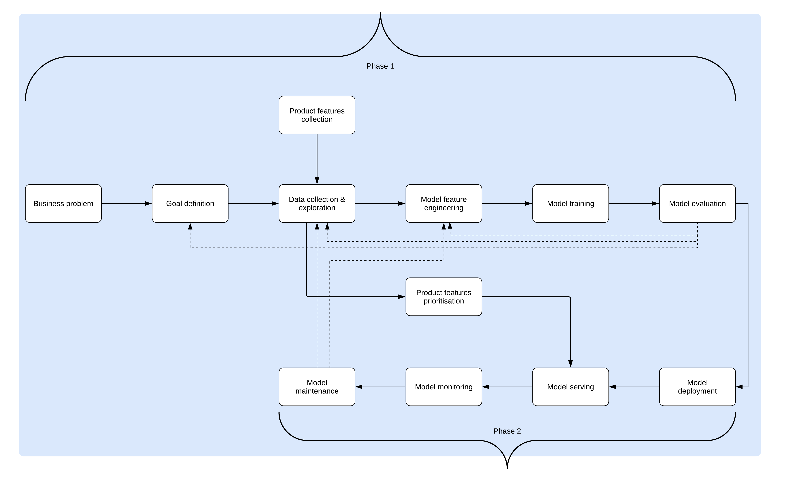

[TOC]

# Decision Science Case Study

## Current Scenario

- Manual predictions using Excel

- Process is different across 4 different regions of Openreach

- Delivery date is only set after planning stage is completed

- The objective is to provide a more efficient way of **predicting** and **estimating** a more accurate delivery date for Openreach's customers.

- **Predicting** refers to minimising human effort and **estimating** refers to precision with approximating delivery dates.

  ​

## What is the Proposed Solution?

**Working project name: Project X**

Automating these predictions using machine learning.

1. Multivariate timeseries regression model

2. Cross validated regression model

   ​

## Measuring the effectiveness of the solution

- Using evaluation metrices;
  - Root Mean Squared Error. This way, we can tell a model that predicts delivery dates for each customer that are much closer to the actual delivery date. This is the most important metric.
  - Mean Absolute Error

## Project X Solution Architecture

To capture the value for this proposal there are other factors that compliment the delivery of this project. These factors are **Infrastructure, People, Tools, Organisation and Processes**. These will help get a better feel for the business case and how to use the resources, assets available to deliver value.

- **Infrastructure** - Cloud services, open-source technologies we can leverage to build on top of. 

- **People** - Map out the roles and skills of the team and identify strengths and skill gaps.

- **Tools** - Building tools to **encapsulate** and **frameworks** to automate. 

- **Organisation** - Encouraging agile methodology. Building flexibility.

- **Processes** - Standardised project structures, version control and codebase practices.

The delivery of this project has been split into 2 phases. 

**Phase 1**

- Delivery of MVP, a prototype solution. This solution is an evaluated machine learning model which will automate the manual predictions made in excel.
- This involves framing the problem, identifying the stakeholders and designing a baseline model that can deliver the minimum viable product. 
- Product feature collection via user stories and feature prioritisation.

**Phase 2**

- Delivery of product, a microservice framework with multiple user interfaces for each region.
- Deploying and serving an improved model which the product will be built on.

> Note: We will make assumptions for cases with very little data to train with. These assumptions will go through hypothesis tests to ascertain if the assumptions are valid.

#### Microservice architecture

It is important to think of our products as customer-driven not data-driven because we are building products that are useful to the customers (focus is on customers) and not products that we can build from the data. The model(s) will be served via microservices with a front-end hosted on GCP App Engine.

With REST APIs, the users of this product from different regions of Openreach can use this service with zero conflict. 

### OKRs

During project planning, it is crucial to set clear goals, communicate regularly with the stakeholders on the project and ensure that all stakeholders are aligned.

> “A goal properly set is halfway reached.” — Zig Ziglar

The core objective for this project is improving certainty for our customers.

How would we achieve this? By creating a more efficient way of predicting and estimating a more accurate delivery date for Openreach's customers.

#### **Measurable key results**

Due to the agile nature of the project, some of the KRs

- Build a model with an RMSE lower than that of the human predictions in excel.
- Create multiple user interface or a single user interface for the 4 different regions of Openreach.
- Deploy an authenticated microservice based framework which can predict and export results of the prediction.
- Collect basic requirements for product feature design.

### Value Framework

The value framework/key performance indicators are key towards monitoring the progress of the product development. Transparency and Integrity are core to the foundation of the core product value framework. 

- Transparency
- Integrity
- Efficient
- Accuracy

### Delivery

#### How will you use your team?

Assuming resource is not a constraint, there will be a 12 weeks delivery timeframe for Phase 1 and 12 weeks for Phase 2 involving weekly sprints. Its safer to make concessions when planning delivery timelines in data science projects. If the project finishes earlier, that's a bonus for the team and the business.

**Phase 1**

- 2-3 weeks to generate the project proposal involving the Project Manager and Senior Data Scientist (myself). During this period, we will clearly frame the problem and define the goals.
- 2-4 weeks for data understanding, cleaning, exploration of data from all 4 different regions and establishing how to align them all.
- 2-3 weeks for model feature selection & engineering, model building and evaluation
- 1 week for QA
- 1 week to prepare to present to key stakeholders

*with weekly sprints to update stakeholders, to be presented by Junior Data Scientist and Senior Data Scientist.

**Phase 2**

- 2 weeks for model deployment
- 6 weeks for model serving
- 2 weeks for model monitoring
- 2 weeks for model maintenance

#### How will you prioritise features?

Feature prioritisation starts with a shared vision and with collaborative leadership. Features will be collected as epics. These epics are a collection of user stories from end users who would end up using the product. With the help of a project/business analyst/product owner, we can collect requirements which will be passed onto the development team. The product features will be agreed upon by ranking the features using certain metrices to avoid feature overload.

1. **Feasibility:** How technically possible is the feature given the resources and tools you currently have? Talk to your technical team members—back-end engineers, UI designers, and front-end developers—to understand what *can* be done (vs. what’s impossible or highly improbable).
2. **Desirability:** Do your customers actually want it? Use every available tool to understand whether this is something your users desire. Essentially, differentiate between basic features, performance features and attractive features. That means talking to researchers, UX designers, marketers, and support, as well as going through any users tests and validation you may have already completed.
3. **Viability:** How does this feature relate to or support the project objectives? Talk to relevant executives and other product managers to understand how this feature works in a bigger ecosystem—both your own (other features, strategies, and goals) and the industry as a whole (regulations, legal issues, financials).

*Note: Research is key in feature prioritisation.

#### How will you keep stakeholders informed?

- Weekly Sprints involving a technical/non-technical, low-level/high level presentations
- Emails, Confluence for sharing documents with stakeholders and collaborative purposes.
- Internally, the technical team will have Jira project monitoring board, Agile boards, RAG sheets to monitor project progress.

## Tools

### External data sources

Covid data that helps us understand how covid might have affected delivery dates.

### Agile PM tools

- GitHub Issues

- GitHub Projects (Kanban boards)

- Jira

### Tools

- Excel
- Git (GitHub Actions)
- GCP

### Open-Source Technologies*

Note that we will try and use containerised open source technologies as much as we can with a focus on test-driven deployment (TDD).

- Python (poetry package, Makefile, pytest)
- FastAPI
- Database: SQLite, PostgreSQL
- Web development
  - Flask (micro web framework), Django (full-stack)
  - React, Angular, NodeJS
  - CSS, HTML
- Makefile
- Docker
- Terraform

